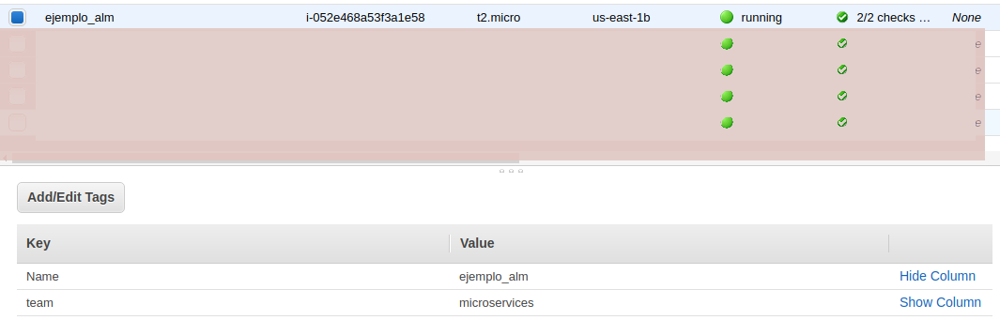

# Primeros pasos con Terraform en AWS.

## 1. Creación de Archivo de credenciales

Para este primer paso crearemos un solo archivo de configuración
con los datos necesarios para acceder a AWS.

```

[testing]
aws_access_key_id = ********
aws_secret_access_key = *******

```

[**Es un seletor de ambiente**]

```bash 
 mkdir ~/.aws;mv credentials ~/.aws/credentials 
 ```
Usted pude verificar el estado de las credenciales así:

```bash 
 cat ~/.aws/credentials 
 ```

## 2. Creación de una instancia en EC2

[Creando una instancia](instaciaEC2.tf)

Inicialice el espacio de trabajo de 

```bash
terraform init
ls -la
```

La carpeta **.terraform** se ha adicionado al espacio de trabajo.

```bash
terraform apply
```
Verificará los cambios necesarios a realizar en AWS. Solicitará confirmación para aplicarlos.



```bash
terraform show
terraform destroy
```